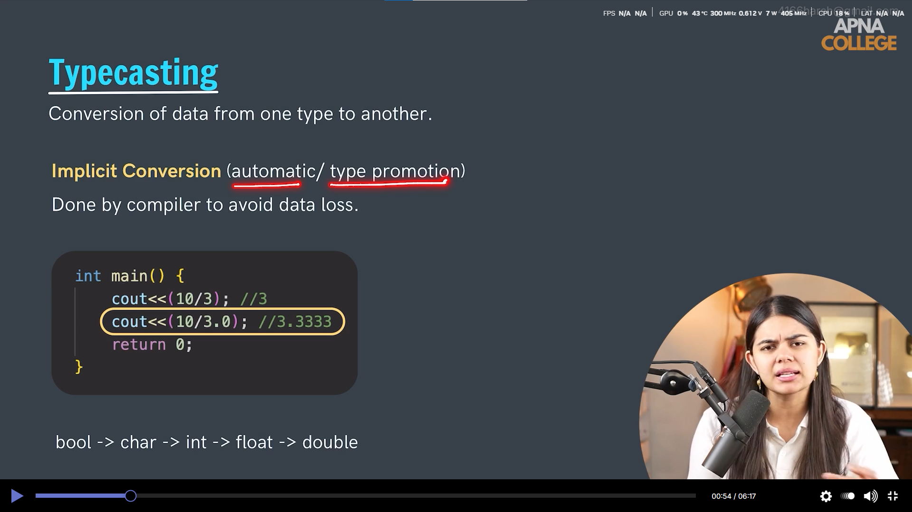

# C++ Programming Notes
Comprehensive notes and examples for learning C++ programming language.

 <!-- Add your screenshot here -->

# Preprocessor Directives

.png) <!-- Add your screenshot here -->

# main function

# name space

# VARIABLE 

# NAMING CONVENTION

Data Types

Symbolic Constant # macros can be used as datatype modifier

Typecasting

implicit

explicit

Operator 

Unary Operator

Assigment Operators 

Relatonal Operators

Logical Operators

## Conditional Statements

if-else

else if

Ternary Operator

Switch Statement
